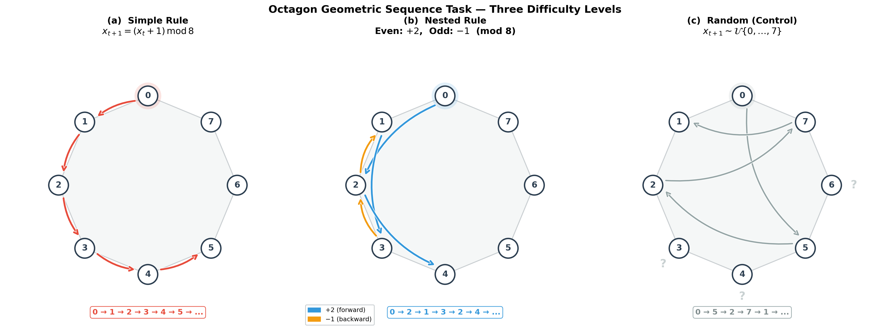
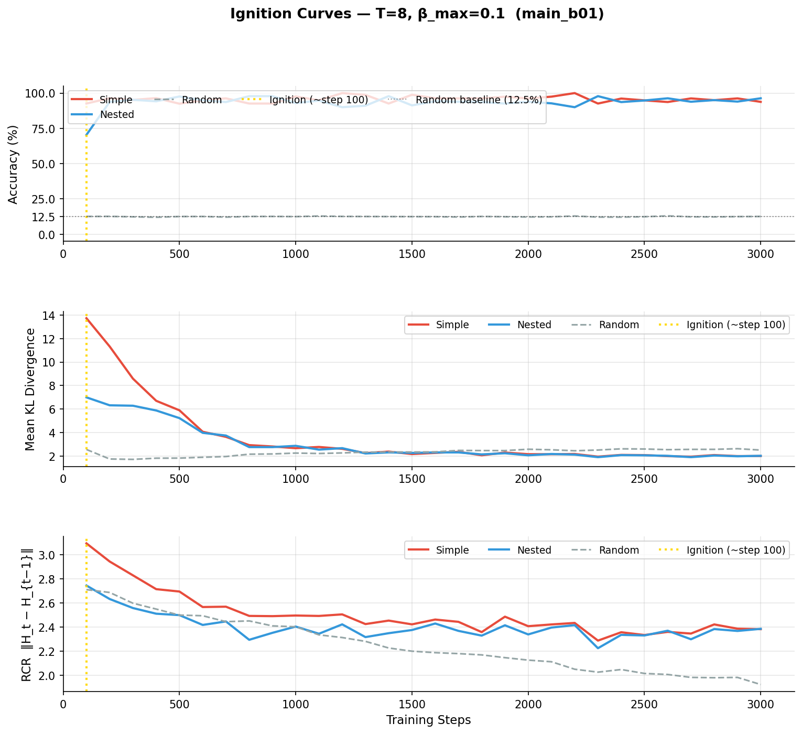
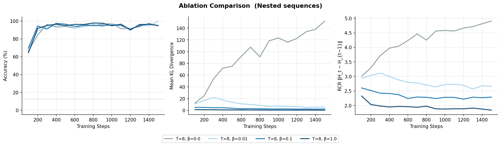
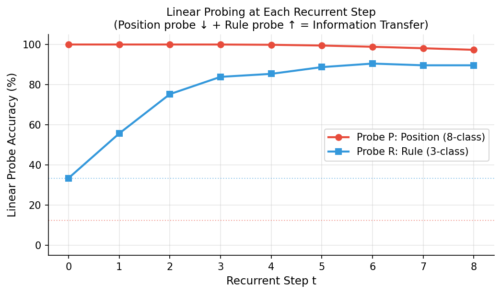
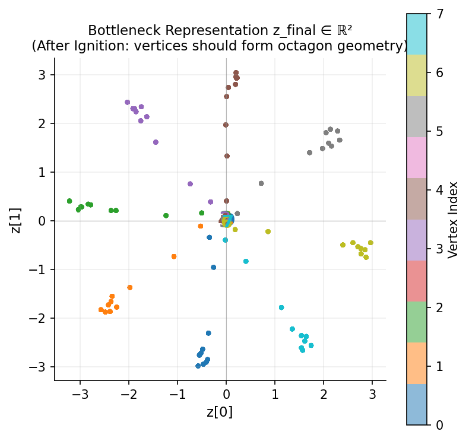
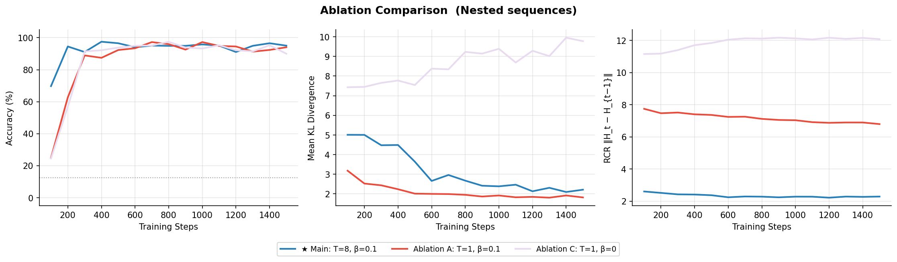

# Ignition Mechanisms in Information-Bottleneck Recurrent Networks

A computational study on the "Ignition" phenomenon from Dehaene's Global Neuronal Workspace (GNW) theory, using a minimalist Recurrent Transformer with Variational Information Bottleneck (VIB) on an octagon geometric sequence prediction task.

**Author:** Puzhi YU
**Date:** January 2026

---

## Overview

This project investigates how neural networks spontaneously learn abstract geometric rules through the interplay of information compression (bottleneck) and recurrent computation (looping). We design a minimal "computational brain" — a 13,292-parameter weight-sharing Recurrent Transformer equipped with a Variational Information Bottleneck — and study the dynamics of rule emergence on an octagon vertex prediction task.

### Research Questions

1. **Q1:** Can a minimalist recurrent network (single layer, weight-sharing, 13K parameters) spontaneously learn nested structural rules from geometric coordinate sequences?
2. **Q2:** Does information bottleneck pressure (VIB, parameter &beta;) produce more compact and stable internal representations without sacrificing prediction accuracy?
3. **Q3:** Does rule information emerge gradually across recurrent steps, or appear instantaneously?

---

## Task Design: Octagon Geometric Sequence

Eight vertices of a regular octagon are encoded as 2D coordinates on the unit circle:

$$\text{input}_k = \left[\cos\!\left(\frac{2\pi k}{8}\right),\ \sin\!\left(\frac{2\pi k}{8}\right)\right] \in \mathbb{R}^2$$

Three sequence types with increasing difficulty:

| Type | Generation Rule | Example (from vertex 0) | Complexity |
|------|----------------|------------------------|------------|
| **Simple** | x(t+1) = (x(t) + 1) mod 8 | 0 &rarr; 1 &rarr; 2 &rarr; 3 &rarr; 4 &rarr; 5 ... | Minimal (period 8) |
| **Nested** | Even steps: +2; Odd steps: -1 (mod 8) | 0 &rarr; 2 &rarr; 1 &rarr; 3 &rarr; 2 &rarr; 4 ... | Medium-high (micro-period 2, macro-period 16) |
| **Random** | Uniform sampling from {0,...,7} | 0 &rarr; 5 &rarr; 2 &rarr; 7 &rarr; 1 ... | Incompressible (control) |

<p align="center">
  
</p>

---

## Model Architecture

```
Input  [B, L=10, 2]            Geometric coordinates
  |
  v
Embedding (Linear 2 -> 32) + Sinusoidal Positional Encoding
  |
  v
Recurrent Loop (T=8 shared-weight steps):
  |   H = TransformerEncoderLayer(H, causal_mask)
  |   record RCR = ||H_t - H_{t-1}||
  v
VIB Layer (readout-stage bottleneck):
  |   mu, sigma = Encoder(H)       [B, L, 32] -> [B, L, 2]
  |   z = mu + eps * sigma          reparameterization
  |   H_out = Decoder(z)            [B, L, 2] -> [B, L, 32]
  v
Output Head (Linear 32 -> 8, softmax)
```

**Key design decisions:**
- **Weight sharing** across all T recurrent steps — forces the model to learn through "thinking time" rather than parameter capacity
- **VIB placed after recurrence** (readout stage), not inside the loop — inside-loop placement causes Posterior Collapse; readout placement aligns with GNW "broadcast" semantics
- **Bottleneck dimension = 2** — same dimensionality as the input coordinates, forcing the model to "reinvent" the input geometry
- **Total parameters: 13,292**

### Loss Function

$$\mathcal{L} = -\log P(Y \mid z) + \beta(t) \cdot \mathrm{KL}\!\left(\mathcal{N}(\mu, \sigma^2)\ \|\ \mathcal{N}(0, I)\right)$$

where &beta;(t) follows a tanh annealing schedule.

---

## Key Results

### 1. Learning Dynamics (Main Model: T=8, &beta;=0.1)

<p align="center">
  
</p>

- Simple and Nested sequences reach 90-100% accuracy within ~100 training steps
- Random sequences remain at chance level (12.5%) throughout training
- KL divergence drops from ~13 to ~2 (85% compression)
- Recurrence Convergence Rate (RCR) decreases, indicating convergence to stable attractors

### 2. Effect of Information Bottleneck (&beta; Sweep)

<p align="center">
  
</p>

| Config | &beta; | Final Accuracy | KL Divergence | RCR |
|--------|-------|----------------|---------------|-----|
| No bottleneck | 0.0 | 93.7% | 208.6 | 5.38 |
| Weak | 0.01 | 100% | 5.84 | 2.79 |
| Medium (main) | 0.1 | 95.0% | 2.27 | 2.42 |
| Strong | 1.0 | 95.0% | 0.36 | 2.03 |

**Insight:** Information compression distinguishes "understanding" from "memorization" — all models achieve high accuracy, but &beta;>0 models compress internal representations dramatically.

### 3. Linear Probing: Gradual Emergence of Rule Information

<p align="center">
  
</p>

- **Position probe (P):** 97-100% accuracy across all recurrent steps — position information is always available
- **Rule probe (R):** Rises from 33% (chance) at t=0 to 91% at t=6 — rule information *gradually emerges* across recurrent steps
- This directly supports the "Recurrence as Thinking Time" hypothesis

### 4. Bottleneck Representation Geometry

<p align="center">
  
</p>

The 2D bottleneck representation z_final spontaneously forms 8 separated clusters with circular topology, recapitulating the octagon geometry. However, this encoding is **nonlinear** — linear decodability from z is near chance, revealing distributed computation rather than holographic storage.

### 5. Ablation Study (2x2 Design)

<p align="center">
  
</p>

|  | T=8 (Recurrence) | T=1 (No Recurrence) |
|--|-------------------|---------------------|
| **&beta;>0 (VIB)** | Main model: 95%, KL=2.3, RCR=2.4 | Ablation A: 96.3%, KL=1.9, RCR=6.4 |
| **&beta;=0 (No VIB)** | Ablation B: 93.7%, KL=208.6, RCR=5.4 | Baseline C: 100%, KL=17.4, RCR=12.9 |

T=1 models achieve high accuracy but exhibit unstable dynamics (high RCR), confirming that recurrence stabilizes internal representations.

---

## Project Structure

```
causal_emergence/
|
|-- model.py              # RecurrentTransformer + VIB layer definition
|-- data_generator.py     # Octagon sequence generation (Simple/Nested/Random)
|-- train.py              # Training loop with beta-annealing schedule
|-- monitor.py            # Ignition curve visualization
|-- analysis.py           # Linear probing, bottleneck analysis, generalization tests
|-- ablation.py           # Ablation experiment runner (2x2 design + beta sweep)
|-- draw_paradigm.py      # Task paradigm schematic figure
|
|-- generate_html_report.py   # Self-contained HTML report generator
|-- generate_pdf_report.py    # PDF report generator
|
|-- checkpoints/          # Saved model weights and training metrics
|   |-- main_b01/         # Primary model (T=8, beta=0.1)
|   |-- T8_b00/           # Beta sweep: no bottleneck
|   |-- T8_b001/          # Beta sweep: weak bottleneck
|   |-- T8_b01/           # Beta sweep: standard bottleneck
|   |-- T8_b10/           # Beta sweep: strong bottleneck
|   |-- T1_b01/           # Ablation A: no recurrence + VIB
|   `-- T1_b0/            # Ablation C: baseline (no recurrence, no VIB)
|
|-- results/              # Output figures and data
|   |-- *.png             # All visualization outputs
|   |-- all_metrics.csv   # Consolidated metrics across all runs
|   `-- summary.json      # Final results summary
|
|-- figures/              # Comparison figures from ablation
|-- REPORT.md             # Full research report (Chinese)
|-- LAB_REPORT.md         # Full lab report (English)
`-- WORKFLOW.md           # Experimental workflow specification
```

---

## Getting Started

### Prerequisites

- Python >= 3.9
- PyTorch >= 2.0
- CUDA (optional, for GPU acceleration)

### Installation

```bash
git clone https://github.com/<your-username>/causal_emergence.git
cd causal_emergence
pip install -r requirements.txt
```

### Training

```bash
# Train the main model (T=8, beta=0.1)
python train.py --T 8 --beta-max 0.1 --run-name main_b01

# Run all ablation experiments (beta sweep + 2x2 ablation)
python ablation.py

# Quick validation run (500 steps)
python ablation.py --quick
```

### Analysis

```bash
# Post-training analysis (linear probing, bottleneck visualization, generalization test)
python analysis.py --checkpoint checkpoints/main_b01/model_best.pt

# Plot ignition curves from saved metrics
python monitor.py --metrics checkpoints/main_b01/metrics.json
```

### Report Generation

```bash
# Generate self-contained HTML report with embedded figures
python generate_html_report.py

# Generate PDF report
python generate_pdf_report.py
```

---

## Hyperparameters

| Parameter | Value | Description |
|-----------|-------|-------------|
| d_model | 32 | Hidden dimension |
| nhead | 4 | Number of attention heads |
| bottleneck_dim | 2 | VIB bottleneck dimension |
| T | 8 | Recurrent steps (main model) |
| L | 10 | Sequence length |
| total_steps | 2,000 | Training iterations |
| batch_size | 128 | Batch size |
| lr | 1e-3 | Learning rate (AdamW) |
| weight_decay | 1e-4 | L2 regularization |
| grad_clip | 1.0 | Gradient norm clipping |
| beta_max | 0.1 | Maximum VIB coefficient |
| warmup_ratio | 0.5 | Beta annealing warmup fraction |
| seed | 42 | Random seed for reproducibility |

---

## References

1. Dehaene, S., Lau, H., & Kouider, S. (2017). What is consciousness, and could machines have it? *Science*, 358(6362), 486-492.
2. Tishby, N., Pereira, F. C., & Bialek, W. (2000). The information bottleneck method. *arXiv preprint physics/0004057*.
3. Alemi, A. A., Fischer, I., Dillon, J. V., & Murphy, K. (2017). Deep variational information bottleneck. *ICLR 2017*.
4. Vaswani, A., et al. (2017). Attention is all you need. *NeurIPS 2017*.

---

## License

This project is licensed under the MIT License. See [LICENSE](LICENSE) for details.

---

## Citation

If you find this work useful, please consider citing:

```bibtex
@misc{yu2026ignition,
  author       = {Yu, Puzhi},
  title        = {Ignition Mechanisms in Information-Bottleneck Recurrent Networks},
  year         = {2026},
  howpublished = {\url{https://github.com/<your-username>/causal_emergence}},
}
```
