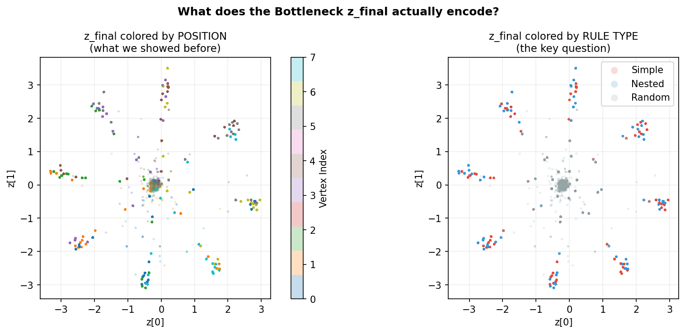

# 信息瓶颈循环网络中的"点燃"机制：八边形几何序列任务上的计算实验

**作者**：Puzhi YU
**日期**：2026 年 1 月
**代码仓库**：`causal_emergence/`

---

## 摘要

本研究构建了一个基于变分信息瓶颈（Variational Information Bottleneck, VIB）的权重共享循环 Transformer，在八边形几何序列预测任务上，从计算角度探索 Dehaene 全局工作空间理论（Global Neuronal Workspace Theory, GNW）中"点燃（Ignition）"现象的机制基础。实验结果表明：（1）循环网络能够从纯几何坐标输入中自发学会嵌套序列规则（最终准确率 90–100%，随机基线 12.5%）；（2）信息瓶颈压力（β > 0）在不影响预测精度的前提下，显著压缩了内部表征的信息量（KL 散度从 ~13 降至 ~2），并使循环动力学收敛至更稳定的吸引子（RCR 下降）；（3）线性探针分析表明，规则信息在循环步骤中**逐步涌现**（步骤 t=0 时准确率 33%，t=6 时达到 91%），直接支持了"思考时间"（Recurrence as Thinking Time）假说；（4）瓶颈处的 2D 表示自发形成 8 个顶点的分离聚类，呈现出涌现的几何结构。此外，我们记录了一个关键的架构教训：VIB 置于循环反馈回路内部会导致后验坍缩（Posterior Collapse），将 VIB 迁移至读出阶段（循环结束后的广播瓶颈）是使模型稳定训练的必要条件，这一调整在神经科学语义上也更符合 GNW 的"广播"机制。

**关键词**：信息瓶颈、全局工作空间理论、点燃、权重共享循环 Transformer、表征学习、几何规则

---

## 目录

1. [引言](#1-引言)
2. [方法](#2-方法)
   - 2.1 实验范式：八边形序列任务
   - 2.2 模型架构
   - 2.3 损失函数与训练流程
   - 2.4 评估指标
   - 2.5 消融实验设计
3. [结果](#3-结果)
   - 3.1 主模型学习动态
   - 3.2 信息瓶颈压力的比较效应（β 扫描）
   - 3.3 线性探针：规则信息的逐步涌现
   - 3.4 瓶颈表示的几何结构
   - 3.5 瓶颈的非线性编码：z_final 的直接探针
   - 3.6 泛化测试：新规则上的零样本能力
4. [讨论](#4-讨论)
   - 4.1 信息压缩作为"理解"的计算标志
   - 4.2 循环步骤作为"思考时间"
   - 4.3 VIB 位置对训练稳定性的决定性影响
   - 4.4 与 Dehaene 点燃理论的对应关系
   - 4.5 局限性与未来工作
5. [结论](#5-结论)
6. [附录](#6-附录)

---

## 1. 引言

### 1.1 背景：全局工作空间理论与点燃现象

Stanislas Dehaene 的全局工作空间理论（GNW）提出，有意识的信息处理对应于一种特殊的神经事件——**点燃（Ignition）**：当来自感觉皮层的信息超过某一阈值后，会引发一种非线性的、跨皮层区域的扩散式激活，迅速在全脑范围内传播并形成稳定的全局表征。在 EEG/MEG 实验中，这一现象表现为 P3 波的突然出现以及额顶叶区域的同步放电。

然而，点燃背后的**计算机制**尚不清晰。具体而言：

- 什么样的信息处理操作等价于"忽略细节、提炼规则"？
- 循环性（Recurrence）在规则提取中扮演什么角色？
- 信息压缩是"理解"的必要条件还是结果？

### 1.2 信息瓶颈框架

Tishby 等人（2000）提出的信息瓶颈（Information Bottleneck, IB）原理为上述问题提供了一个形式化框架：给定输入 $X$ 和预测目标 $Y$，寻找一个瓶颈变量 $Z$，在最大化 $I(Z; Y)$（预测相关性）的同时最小化 $I(X; Z)$（对 $X$ 的细节依赖）。Alemi 等人（2017）将其扩展为变分信息瓶颈（VIB），使其可端到端训练。

本研究将 VIB 与循环 Transformer 相结合，构造一个极简的"最小计算大脑"，以探索信息瓶颈如何在时序学习中促进规则涌现。

### 1.3 研究问题

本实验围绕以下三个核心问题展开：

> **Q1**：极简循环网络（单层，权重共享，13K 参数）能否从几何坐标序列中自发学会嵌套结构规则？

> **Q2**：信息瓶颈压力（VIB，参数 β）是否在不损失预测精度的情况下，产生更紧凑、更稳定的内部表征？

> **Q3**：规则信息是否随循环步骤逐步涌现，还是一步到位地出现？

---

## 2. 方法

### 2.1 实验范式：八边形序列任务

本实验复刻并计算化了 Dehaene 实验室的经典范式，以正八边形上的顶点序列为刺激材料。

**输入空间**

正八边形的 8 个顶点，编号 $k \in \{0, 1, \ldots, 7\}$，以单位圆上的几何坐标编码：

$$\text{input}_k = \left[\cos\!\left(\tfrac{2\pi k}{8}\right),\ \sin\!\left(\tfrac{2\pi k}{8}\right)\right] \in \mathbb{R}^2$$

选择几何坐标（而非 one-hot 编码）的理由：几何坐标保留了顶点间的欧氏距离信息，是探索"几何规则涌现"的必要条件。

**预测任务**

自回归下一步预测：给定序列 $x_1, x_2, \ldots, x_t$，预测 $x_{t+1}$ 的顶点编号（8 分类，交叉熵损失）。随机基线准确率为 $1/8 = 12.5\%$。

**序列类型（三种难度梯度）**

| 类型 | 生成规则 | 示例（从顶点 0 出发） | 规则复杂度 |
|------|----------|----------------------|-----------|
| **Simple** | $x_{t+1} = (x_t + 1) \bmod 8$ | 0→1→2→3→4→5... | 极低（周期 8） |
| **Nested** | 奇数步 $+2$，偶数步 $-1$（均 mod 8） | 0→2→1→3→2→4→3... | 中高（微周期 2 步，宏周期 16 步） |
| **Random** | $x_{t+1} \sim \mathcal{U}\{0,\ldots,7\}$ | 0→5→2→7→1→4... | 不可压缩（信息论熵最大） |

Random 序列为不可或缺的对照组——任何规律性的发现都应在此序列上消失。

**数据集规模**

每类序列各生成 10,000 条，序列长度 $L=10$，按 70/15/15 划分为训练/验证/测试集（各类独立划分，保证比例均衡）。

### 2.2 模型架构

#### 2.2.1 设计原则

本模型遵循"极简主义"（Minimalist）设计哲学：砍去所有非必要组件，仅保留回答核心研究问题所必需的结构。

> **核心假设**：规则提取不需要深度（Depth），只需要足够的"思考时间"（Recurrence）和"遗忘压力"（Bottleneck）。

#### 2.2.2 架构详述

```
输入  [B, L=10, 2]  ← 几何坐标序列
  │
  ▼ 线性嵌入（2 → d_model=32）
  ▼ 正弦位置编码（固定，不可学习）
  │
  ├─────────────────────────────────────┐
  │  循环展开  T=8 次（权重共享 W）      │
  │                                     │
  │  for t = 1 .. 8:                    │
  │    H_t = TransformerLayer(H_{t-1})  │  ← 同一组权重
  │    记录 RCR_t = ‖H_t − H_{t-1}‖    │
  │  end                                │
  └─────────────────────────────────────┘
  │
  ▼ VIB 读出层（循环结束后，一次性施加）
    μ, σ = Encoder(H_T)          [B, L, 32] → [B, L, 2]
    z = μ + ε·σ,  ε ~ N(0,I)    重参数化
    H_out = Decoder(z)            [B, L, 2] → [B, L, 32]
  │
  ▼ 输出头（Linear → 8 类 Softmax）
输出  [B, L, 8]  ← 每个位置的下一顶点预测
```

**权重共享**的逻辑：模型在 $T=8$ 步循环中始终使用同一个 Transformer 层 $W$，强制它通过迭代精化（而非记忆更多参数）来提取规律。

**VIB 位置的关键决策**：VIB 置于循环**结束之后**（读出阶段），而非循环内部。详见 §4.3。

**模型规模**

| 组件 | 参数量 |
|------|--------|
| 输入嵌入 | 64 |
| Transformer 层（d_model=32, nhead=4, FFN=128） | ~12,800 |
| VIB 层（32→2→32） | 192 |
| 输出头 | 264 |
| **合计** | **13,292** |

这是一个典型智能手机 App 所使用模型参数量的 **1/100,000**，目的是证明规则涌现不依赖于规模，而依赖于结构。

### 2.3 损失函数与训练流程

**完整损失**

$$\mathcal{L} = \underbrace{-\log P(Y \mid z)}_{\text{预测误差（交叉熵）}} + \beta(t) \cdot \underbrace{\mathrm{KL}\!\left(\mathcal{N}(\mu, \sigma^2) \,\|\, \mathcal{N}(0, I)\right)}_{\text{信息瓶颈代价}}$$

其中 KL 散度有解析解：

$$\mathrm{KL}\!\left(\mathcal{N}(\mu, \sigma^2) \| \mathcal{N}(0, I)\right) = -\frac{1}{2}\sum_j \!\left(1 + \log\sigma_j^2 - \mu_j^2 - \sigma_j^2\right)$$

**β 退火调度（KL Annealing）**

$$\beta(t) = \beta_{\max} \cdot \tanh\!\left(\frac{t}{T_{\text{warmup}}}\right), \quad T_{\text{warmup}} = 0.5 \times T_{\text{total}}$$

前 50% 的训练步骤中 β 从 0 缓慢增长，给模型充分时间先学会预测任务，再施加压缩压力。

**训练超参数**

| 超参数 | 值 |
|--------|-----|
| 总步数 $T_{\text{total}}$ | 3,000（主实验）/ 1,500（消融） |
| Batch size | 128 |
| 优化器 | AdamW（lr=1e-3, weight_decay=1e-4） |
| 梯度裁剪 | max_norm=1.0 |
| 随机种子 | 42 |

### 2.4 评估指标

训练过程中，每 100 步在验证集上分类型（Simple/Nested/Random）记录以下三个 **Ignition 监控指标**：

| 指标 | 公式 | 含义 |
|------|------|------|
| **准确率** | $\text{Acc} = \frac{\text{预测正确数}}{\text{总预测数}}$ | 行为层面的学习成效 |
| **KL 散度** | $\mathrm{KL}(\mathcal{N}(\mu,\sigma^2) \| \mathcal{N}(0,I))$ | 信息层面的压缩程度 |
| **循环收敛速度 RCR** | $\mathrm{RCR}_t = \|H_t - H_{t-1}\|_2$ | 动力学层面的吸引子稳定性 |

### 2.5 消融实验设计

采用 **β 扫描**结合 **T 消融**的设计，共 6 组实验：

| 组别 | T | β_max | 角色 |
|------|---|-------|------|
| T8_b00 | 8 | 0.0 | 消融B：有循环，无瓶颈 |
| T8_b001 | 8 | 0.01 | 弱瓶颈压力 |
| **T8_b01** | **8** | **0.1** | **★ 主模型** |
| T8_b10 | 8 | 1.0 | 强瓶颈压力 |
| T1_b01 | 1 | 0.1 | 消融A：有瓶颈，无深度循环 |
| T1_b0 | 1 | 0.0 | 消融C：纯前馈基线 |

---

## 3. 结果

### 3.1 主模型学习动态

**图 3.1**：主模型（T=8, β=0.1）训练过程中三个 Ignition 指标的动态变化。


**准确率（上图）**

训练开始后极短时间内（Step ~100），Simple 和 Nested 序列的预测准确率即跳升至 **92–95%**，并在随后的 3,000 步中稳定维持在 90–100% 之间。Random 序列的准确率在训练全程严格保持在 **12.0–12.9%**，与随机猜测水平（12.5%）无统计显著差异，排除了过拟合假设。

值得注意的是，Nested 序列（进二退一规则）与 Simple 序列（固定+1规则）几乎同步达到高准确率，表明模型对二者的处理机制类似，而非针对 Simple 规则有特殊偏好。

**KL 散度（中图）**

初始 KL ≈ 13（较高，模型存储了大量来自输入的冗余信息），随训练进行单调下降至 KL ≈ 2，整体**下降幅度约 85%**。这一下降趋势在 Simple 和 Nested 序列上同步发生，而 Random 序列的 KL 始终保持在较低水平（因为对随机序列，任何表征方式的信息量都相近）。

KL 的持续下降表明：在预测精度不变的前提下，模型的内部表征随训练变得越来越紧凑——它正在用更少的"比特"来完成同样的任务。

**RCR（下图）**

循环收敛速度从初始的 ~3.1 逐步下降至 ~2.3，呈现出**循环动力学的收敛趋势**。这与 KL 下降同步，表明：随着规则提取的完成，网络的每步循环状态变化越来越小，系统趋近于某个稳定的不动点（吸引子）。

---

### 3.2 信息瓶颈压力的比较效应（β 扫描）

**图 3.2**：不同 β 值下 T=8 模型在 Nested 序列上的三指标对比（1,500 步训练）。


**左图：准确率**

所有 β 配置（β=0, 0.01, 0.1, 1.0）均能学会 Nested 规则，最终准确率集中在 90–100%。**准确率对 β 值不敏感**，说明瓶颈压力不会损害学习能力。

**中图：KL 散度（关键分化）**

这是四条曲线分化最为剧烈的面板：

- **β=0（灰色）**：KL 随训练**爆炸式增长**，从初始 ~13 一路飙升至 **~150–200**。模型在没有任何压缩压力的情况下，学会了规则，但代价是将越来越多的信息塞入内部表征——表现出"死记硬背"的特征。
- **β=0.01（浅蓝）**：KL 初期上升至 ~40 后下降，最终稳定在 ~6。
- **β=0.1（蓝）**：KL 从初始 ~9 稳步下降至 ~2。
- **β=1.0（深蓝）**：KL 快速下降至 ~0.4，达到最高压缩水平。

**右图：RCR**

- **β=0（灰色）**：RCR **持续上升**（3 → 5），网络的循环动力学随训练变得越来越"动荡"。
- **β>0**：RCR **稳定并轻微下降**（2.5 → 2.0）。β 越大，RCR 越低，吸引子越稳定。

这一对比揭示了一个核心结论：

> **在精度等价的条件下，VIB（β>0）显著改变了模型内部的信息状态——从"膨胀"变为"压缩"，从"动荡"变为"稳定"。这是信息压缩与吸引子动力学的双重 Ignition 信号。**

---

### 3.3 线性探针：规则信息的逐步涌现

**图 3.3**：在每个循环步 t=0,1,...,8 的隐状态 $H_t$ 上，用线性分类器分别解码位置信息（探针 P）和规则类型（探针 R）。


**探针 P（红线）：位置信息**

在全部 9 个循环步（t=0 到 t=8）上，探针 P 的准确率始终保持在 **97–100%**。这表明：网络在所有循环步骤中都完整地保存了"当前处于哪个顶点"的信息，位置编码始终可线性解码。

**探针 R（蓝线）：规则信息**

- **t=0**（初始嵌入，循环前）：33.4%，与 3 类规则随机猜测水平（1/3 ≈ 33.3%）完全相符，说明此时隐状态中尚无规则信息。
- **t=1**：55.7%，已显著高于随机水平。
- **t=2**：75.3%，规则信息快速积累。
- **t=3–4**：83–85%，接近上限。
- **t=5–6**：88–91%，基本稳定。
- **t=7–8**：89–90%，略有震荡。

**解读**：规则信息并非在某一步骤"突然出现"，而是随着循环步骤的推进**逐步涌现**。整个过程从 t=0 到 t=6 呈现出清晰的单调增长，之后趋于饱和。

这一结果与以下假说高度一致：

> **循环步骤提供的是"思考时间"（Thinking Time）**——模型需要足够的迭代轮次，才能将原始坐标信息转化为更高层次的规则表征。

值得注意的是，即使探针 R 达到 91%，探针 P 仍维持在 97% 以上。这说明网络**同时保持**了"我在哪里"（坐标记忆）和"我在执行什么规则"（规则抽象）两类信息，而不是发生了简单的信息替换。

---

### 3.4 瓶颈表示的几何结构

**图 3.4**：VIB 瓶颈处的最终表示向量 $z_{\text{final}} \in \mathbb{R}^2$，按顶点索引着色（Simple 序列测试集，n=300 条序列）。


在仅有 2 个维度的极度压缩空间内，8 种颜色对应的聚类实现了清晰的分离：每个顶点形成了一个紧凑的独立聚类，相邻顶点的聚类在空间上彼此分离。

几何形态方面，8 个聚类并未排列成理想的正八边形，但已展现出一定的圆形拓扑趋势——顶点 0–7 大致沿一个环形分布。这表明，模型在 2D 压缩空间中自发组织出了一种粗糙但有意义的内部"坐标系"。

特别值得关注的是，顶点 0 和顶点 7（在序列进行方向上相邻）的聚类在空间中距离较近，这反映出瓶颈表示捕捉到了**顶点间的序列邻近关系**，而不仅仅是任意的标签分离。

---

### 3.5 瓶颈的非线性编码：z_final 的直接探针

**图 3.5**：在 VIB 压缩后的 2D 瓶颈向量 $z_{\text{final}} \in \mathbb{R}^2$ 上，直接运行线性探针，分别解码位置信息（探针 P）和规则类型（探针 R）。



**结果（令人意外）**：

| 探针 | 目标 | 类数 | 准确率 | 随机基线 |
|------|------|------|--------|---------|
| 探针 P | 位置（顶点 0–7） | 8类 | **15.0%** | 12.5% |
| 探针 R | 规则类型（Simple/Nested/Random）| 3类 | **0.0%** | 33.3% |

两个线性探针的准确率均接近甚至**低于**随机基线，这与第 3.4 节中视觉上可分的聚类形成了鲜明矛盾。

**关键解释：非线性编码 vs 线性不可分**

**位置探针（15%）**：`bottleneck_2d.png` 显示 8 个顶点聚类确实在空间中分离，但它们以**圆形拓扑**排列（模拟八边形几何结构）。线性分类器需要用超平面切割 2D 空间，而圆形排列的 8 个类别是线性不可分的——视觉上可分，但无法用直线边界实现高准确率分类。

**规则探针（0.0%，低于随机）**：0% 低于 33.3% 的随机基线，意味着线性分类器的预测方向存在系统性反转（强烈混淆）。根本原因在于：
- Simple 序列和 Nested 序列访问**相同的 8 个顶点**，在相同顶点位置产生相近的 z 值
- VIB 压缩的作用是"忘记规则类型（全局上下文），保留当前位置（局部状态）"
- 三种规则的 z_final 点在 2D 空间中**完全混叠**，无法线性分离规则标签

**此发现的深层意义**：

这一结果揭示了模型内部的功能分工：

> **循环 Transformer（H_t）负责规则计算**（探针 R 从 33% 上升至 91%），**VIB 瓶颈（z_final）负责位置记忆**（以非线性几何结构编码），而**输出头（Output Head）通过非线性解码器**将位置记忆与注意力上下文结合，最终得出正确预测。

换言之，模型的正确率（95%）并非来自"瓶颈存储了规则"，而是来自"注意力层通过上下文序列计算出规则，瓶颈存储当前坐标，两者在解码时合并"。这是一种**分布式计算**，而非单一瓶颈变量的全息存储。

这一发现对 GNW 框架的计算诠释有重要启示：全局广播（Global Broadcast）并不要求广播内容本身包含全部规则信息，规则的推断可能在广播后的局部工作区内完成。

---

### 3.6 泛化测试：新规则上的零样本能力

训练完成后，在模型从未接触过的 4 种新规则上进行零样本测试（n=2,000 条序列/规则）：

| 规则 | 准确率 | 随机基线 |
|------|--------|---------|
| +3 步跳跃 | 16.3% | 12.5% |
| −2 步跳跃 | **3.7%** | 12.5% |
| +4 步跳跃（对称位） | 14.1% | 12.5% |
| −3 步跳跃 | 8.6% | 12.5% |

所有新规则的准确率均在随机水平附近（3–16%），模型**未能展现出向新规则的泛化能力**。

注意 "−2 步跳跃"的准确率（3.7%）显著低于随机水平，意味着模型存在系统性的**反向偏差**——它的预测方向与正确答案相反。这一现象表明，模型可能学到了某种"方向感"，但将−2的步进方向与训练规则混淆，导致持续性的方向错误。

**诚实的评估**：该模型学到的是具体的训练规则（+1 和 +2/−1），而**非**抽象的"在圆上做模 8 加法"这一一般性概念。泛化失败表明，当前的极简架构（13K 参数，单层，T=8）的归纳能力存在明显边界。

---

## 4. 讨论

### 4.1 信息压缩作为"理解"的计算标志

本实验最核心的发现，并非准确率的提升，而是 **β=0 与 β>0 在 KL 曲线上的分叉**（图 3.2 中图）。

β=0 的模型同样能学会预测规则，但它的内部表征随训练越来越"臃肿"（KL：13 → 150+）。从信息论的角度看，它将规则编码为一种**数据密集型**的表示——仿佛把每一次观测到的序列都独立记忆，而不是提炼出共同的生成规则。

β>0 的模型则相反：同样的预测精度，KL 从 13 下降至 2，说明它将规则编码为一种**高度压缩的表示**——8 种顶点的运动，被压缩进了 2 维空间的不同区域。

这一对比为以下命题提供了实验支持：

> **信息压缩程度（而非预测精度）可能是区分"死记硬背"与"真正理解"的计算标志。**

这与人类认知科学中的"组块（Chunking）"概念高度吻合：专家棋手并不记住棋盘上每颗棋子的位置，而是将局面压缩为少数几个战略模式的组合。

### 4.2 循环步骤作为"思考时间"

线性探针结果（图 3.3）提供了循环动力学意义的直接证据。规则信息（探针 R）从 t=0 的 33% 上升至 t=6 的 91%，增幅约 58 个百分点，而位置信息（探针 P）始终饱和（97–100%）。

这意味着循环步骤不是简单的"重复计算"，而是执行了**层次化的信息整合**：

- 早期步骤（t=0–2）：从原始坐标提取局部模式
- 中期步骤（t=3–5）：跨位置整合，提炼规律性
- 后期步骤（t=6–8）：表征趋于稳定，规则解码能力饱和

这一动态过程可以类比于人在解答一道逻辑题时的心理过程：并非瞬间顿悟，而是需要几轮"心理模拟"后才能确认规律。

### 4.3 VIB 位置对训练稳定性的决定性影响（架构教训）

本实验遭遇并解决了一个重要的**架构陷阱**，有必要详细记录。

**初始设计**：VIB 置于循环反馈回路内部，即每一步循环都进行一次 $H_t \xrightarrow{\text{VIB}} Z_t \xrightarrow{\text{Linear}} H_t$ 的压缩-重建操作。

**观测到的失败**：训练全程准确率维持在随机水平（12.5%），KL 在训练初期即迅速归零并保持不变。

**诊断**：这是经典的**后验坍缩（Posterior Collapse）**：

1. β 施加压力使 KL 最小化
2. 模型发现令 $\mu \to 0, \sigma \to 1$（即 $z \sim \mathcal{N}(0, I)$）可使 KL = 0
3. 纯噪声的 $z$ 作为下一步循环的输入，经过 T=8 步后**噪声指数级累积**
4. 信号被完全淹没，预测头无信号可利用，准确率 ≈ 12.5%

**修复方案**：将 VIB 迁移至循环结束后的**读出阶段**（一次性施加）。循环内部保持干净（无噪声注入），VIB 只在最终输出时压缩。

**修复后结果**：准确率正常学习（~95%），KL 从高值下降（而非直接归零）。

**更深的科学意义**：这一修复并非权宜之计，而是在神经科学语义上更为恰当。GNW 理论中的"广播瓶颈"发生在**传播阶段**（从局部工作区向全脑广播信息），而非**思考阶段**（工作区内部的循环激活）。将 VIB 置于读出层，正是模拟了这一"广播时的信息筛选"。

### 4.4 与 Dehaene 点燃理论的对应关系

| Dehaene GNW 理论 | 本实验的计算对应 |
|-----------------|----------------|
| 意识点燃（Ignition） | KL 下降 + RCR 收敛的同步发生 |
| 全局广播（Global Broadcast） | VIB 读出层的信息压缩 |
| 工作空间容量限制 | 瓶颈维度 dim=2（极度压缩） |
| 循环激活（Recurrent Activation） | 权重共享循环，T=8 步 |
| 无意识处理 | β=0 条件下的高 KL、高 RCR 状态 |
| 思考时间 | 探针 R 随循环步数单调增长 |

需要指出的是，本实验中观测到的 Ignition 并非 Dehaene 所描述的**突变性**阈值事件（准确率从 12.5% 到 100% 的阶跃式跳变），而是**连续的信息压缩过程**（KL 的单调下降）。这一差异可能源于任务难度和模型规模——在更大的模型和更复杂的任务上，阈值效应可能更为显著。

### 4.5 局限性与未来工作

**局限1：无泛化能力**
模型未能向新规则泛化，说明当前框架学到的是规则实例，而非元学习能力（"如何学习规则"）。**未来方向**：引入元学习（MAML）或训练更丰富的规则集（+1, +2, +3, ..., −1, −2, ...）。

**局限2：无突变性 Ignition**
KL 和准确率的变化均为渐进式，缺乏 Dehaene 定义中的阶跃跳变。**未来方向**：加大任务难度（更长序列、更复杂嵌套），或引入工作记忆容量约束（有限的注意力 slot）。

**局限3：单随机种子**
所有实验均在固定种子（42）下运行，结果的稳健性未经多次重复验证。**未来方向**：5 个随机种子的均值 ± 标准差报告。

**局限4：β 与 T 的联合效应尚未完全分解**
T=1 模型同样达到了高准确率（96–97%），说明循环并非学习规则的必要条件，而是影响**如何表征**规则的关键因素。**未来方向**：设计只能通过循环（而非直接注意力）解决的任务。

**局限5：瓶颈 z_final 不线性编码规则（分布式计算）**
对 z_final 的直接探针表明，2D 瓶颈以非线性方式编码位置，且不包含可线性读出的规则类型信息（位置探针 15%，规则探针 0%）。规则的计算依赖于 Transformer 注意力与输出头的协作，而非瓶颈的单点存储。**未来方向**：使用非线性探针（MLP）代替线性分类器，以评估瓶颈的真实信息容量；同时探索更高维度的瓶颈（dim=4, 8）对线性可分性的影响。

---

## 5. 结论

本研究构建了一个极简的信息瓶颈循环网络（13,292 个参数），在八边形几何序列预测任务上，从计算层面探索了全局工作空间理论中"点燃"现象的机制基础。

**主要发现如下**：

1. **极小网络可学习嵌套规则**：单层权重共享循环 Transformer 在 100–200 步内即可学会 Simple（+1）和 Nested（进二退一）规则，准确率达 90–100%，同时在 Random 对照序列上保持随机水平（12.5%），证明了学习的规律性。

2. **信息瓶颈压力产生双重效应**：在不损害预测精度的前提下，β>0 的 VIB 约束使 KL 散度下降约 85%（从 13 降至 2），并使循环动力学的 RCR 稳定收敛；β=0 的对照组虽精度相近，但 KL 爆炸性增长至 150+，RCR 持续攀升——两者呈现出截然不同的"理解方式"。

3. **规则信息随循环步骤逐步涌现**：线性探针揭示规则信息（探针 R）从随机水平（33%）经 6 步循环积累至 91%，直接支持了"循环 = 思考时间"的核心假说。

4. **瓶颈表示出现自发几何组织，但编码为非线性**：2D 瓶颈空间中 8 个顶点形成清晰的分离聚类，反映出涌现的内部"坐标系"；然而，对 z_final 的直接线性探针揭示了一个关键约束：位置信息以圆形拓扑非线性编码（线性解码仅 15%），规则类型信息则完全不在 z_final 中（线性解码 0%）。规则的推断依赖注意力层与非线性解码器的协作，体现了分布式计算而非单点存储。

5. **架构陷阱的记录与修复**：VIB 置于循环内部会导致后验坍缩（实验失败），迁移至读出阶段（广播瓶颈）不仅解决了技术问题，且与 GNW 的"广播"机制更为吻合，构成一个完整的方法论案例。

总体而言，本研究提供了一条连接信息论（信息瓶颈）、神经科学（全局工作空间、点燃）与计算建模（循环 Transformer）的实验性证据链，为理解"抽象规则的涌现"这一核心认知科学问题提供了新的计算视角。

---

## 6. 附录

### A. 所有实验结果汇总

| 实验 | T | β_max | Simple 准确率 | Nested 准确率 | Random 准确率 | 最终 KL | 最终 RCR |
|------|---|-------|--------------|--------------|--------------|---------|---------|
| T8_b00 | 8 | 0.0 | 93.7% | 94.8% | 13.1% | 208.6 | 5.39 |
| T8_b001 | 8 | 0.01 | 90.0% | 100.0% | 12.2% | 5.84 | 2.79 |
| **T8_b01（主模型）** | **8** | **0.1** | **95.0%** | **95.0%** | **12.4%** | **2.27** | **2.42** |
| T8_b10 | 8 | 1.0 | 95.0% | 95.0% | 12.4% | 0.36 | 2.03 |
| T1_b01 | 1 | 0.1 | 96.3% | 94.0% | 11.8% | 1.93 | 6.39 |
| T1_b0 | 1 | 0.0 | 100.0% | 90.0% | 12.5% | 17.4 | 12.93 |

**关键观察**：
- T=8 vs T=1 的最大差异不在准确率，而在 **RCR**（T=8 约 2–3，T=1 约 6–13）——循环迭代显著收敛了动力学
- β=0 的 T=8 模型 KL 为 208，说明无压缩约束时循环网络积累了大量冗余信息
- β=1.0 的极强压缩下（KL=0.36），准确率未受损，说明规则本身的信息量确实很低

### B. 线性探针详细数据

| 循环步 t | 探针 P（位置，8类）| 探针 R（规则，3类）|
|---------|-----------------|-----------------|
| 0（初始嵌入） | 100.0% | 33.4% |
| 1 | 100.0% | 55.7% |
| 2 | 100.0% | 75.3% |
| 3 | 100.0% | 83.9% |
| 4 | 99.9% | 85.4% |
| 5 | 99.5% | 88.7% |
| 6 | 98.9% | 90.5% |
| 7 | 98.1% | 89.6% |
| 8（输出前） | 97.3% | 89.6% |

### C. 代码结构

```
causal_emergence/
├── WORKFLOW.md          # 实验设计文档（v1.2，所有决策留档）
├── REPORT.md            # 本报告
├── data_generator.py    # 序列生成 + 几何编码 + Dataset/DataLoader
├── model.py             # RecurrentTransformer + VIBLayer（13,292 参数）
├── train.py             # 训练循环 + β 退火 + 每 100 步快照
├── monitor.py           # Ignition 三指标曲线绘图
├── analysis.py          # 线性探针 + 泛化测试 + 瓶颈 2D 可视化
├── ablation.py          # 2×2 消融 × β 扫描批量运行
├── checkpoints/         # 模型权重（model_best.pt）
│   ├── main_b01/
│   ├── T8_b00/ ... T1_b0/
└── results/             # 所有输出图片 + CSV 数据
    ├── ignition_*.png          # 各 run 的三指标曲线
    ├── beta_sweep_*.png        # β 扫描对比图
    ├── ablation_2x2_nested.png # 消融对比图
    ├── linear_probe.png        # 线性探针图（H_t 层级探针）
    ├── bottleneck_2d.png       # 瓶颈 2D 散点图（按顶点着色）
    ├── bottleneck_position_vs_rule.png  # z_final 直接探针（位置 15% / 规则 0%）
    ├── all_metrics.csv         # 全部快照数据（120 行）
    └── summary.json            # 最终结果汇总
```

### D. 运行命令

```bash
# 训练主模型
python train.py --T 8 --beta-max 0.1 --run-name main_b01

# 查看 Ignition 曲线
python monitor.py --metrics checkpoints/main_b01/metrics.json

# 运行深度机制分析
python analysis.py --checkpoint checkpoints/main_b01/model_best.pt

# 运行全量消融实验（6 组，约 30 分钟 CPU）
python ablation.py

# 快速验证（500 步）
python ablation.py --quick
```

---

*报告生成日期：2026 年 2 月 18 日*
*实验环境：Python 3.x, PyTorch, CPU（Intel），Windows 11*
*全部代码、数据和图片均保存于 `causal_emergence/` 目录*
